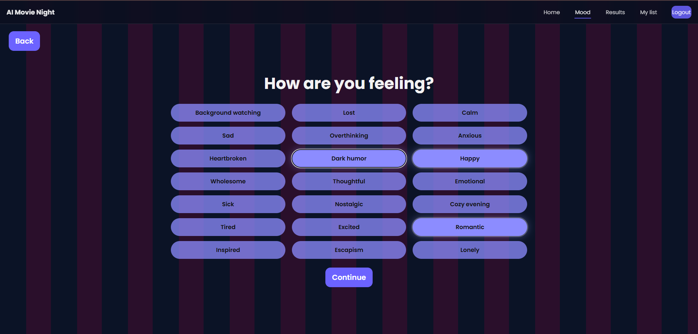
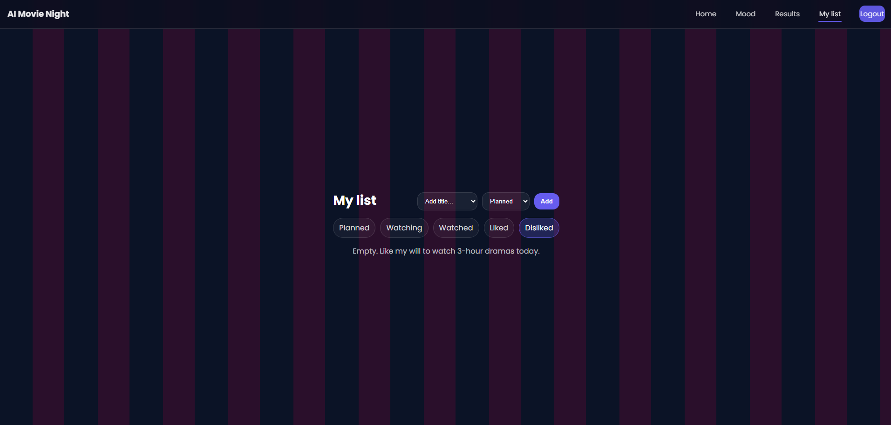

# Movie Mood Finder 🎬

A web application that recommends movies based on the user's mood.

## Features

* choose a mood
* get movie recommendations
* user registration and login
* personal movie lists

## Tech Stack

* Python
* Django
* HTML
* CSS
* JavaScript

## How to run locally

1. Clone the repository
2. Install dependencies
3. Run migrations
4. Start the server

```bash
python manage.py migrate
python manage.py runserver
```
## Screenshots

### Home


### Mood selection


### Movie results


### My list

